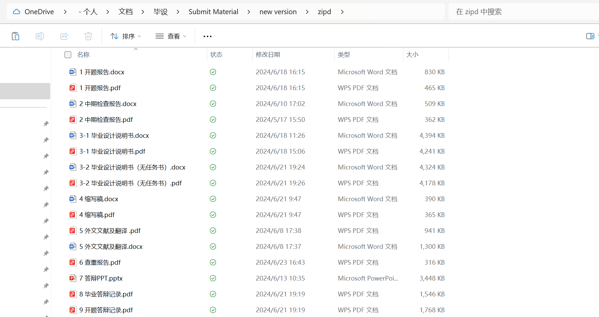

## 毕业设计
这里是毕业设计的相关参考文档，包含模板、材料、光盘等说明
### 1、教务处官方文件
学校教务处有一个模板，但是其中存在些许谬误，与专业主任要求不尽一致，然而各个指导老师可能和专业主任要求又不一致，以指导老师的要求为准。  
### 2、选题建议
事实上，毕业设计就是一个折磨的过程，完成这个任务的舒适度取决于指导老师的能力、态度和负责态度。你会发现，各个老师的信息是不对称的、他们的要求也是不尽相同的，所以也要多和别的指导老师带的同学通气，避免被指导老师带坑里。  
一般的，我们认为网络工程专业最好的指导老师是丁磊老师，慈祥、和蔼、负责、有能力，但是他的课题也是最难抢的，一般的，教务处会通知毕业设计选题时间，和抢课一样登录到教务系统，每一个老师有许多课题，每个课题可以被两个人选择，选满后不可再选，接下来将会由老师从选这个课题的两个人里面选一个，至于老师会怎么选，可能取决于你上他课的态度和给他留下的映像，如果被老师给筛掉了，就会进入到补选环节，一些不受欢迎的老师现在基本都是空的，将会有很大的可能性被调剂到某些老师的门下；因此，如果要选一个受欢迎的老师，你应该从大三或者大四下学期好好表现，比如实验大家都润唯独你去认真做、没人上课你去和老师聊天（事实上到了大四基本上没得人去上课，但是老师都会在上课时间去教室，如果有两三个人来的话也不会讲课了，聊一些就业、人生规划、社会问题相关的内容）。

对于部分老师的评价  
 - 还是不写了。。。大家应该心里都有数，如果想讨论的话可以开issue
 - 一般的，我们认为上课认真、不没事找事搞翻转课堂、讲课口齿清晰、工作认真不懒政的都是好老师

对于选题，网络工程专业学生建议选择网络工程类题目，相对程序开发类会简单一些，没有那么繁琐，也和专业更加契合； **如果你考上了别的方向的研究生或者准备考研，建议选一个和你硕士专业相关的课题；如果你想要做开发，也不建议选这方面的课题；总而言之，考虑到你的职业生涯规划，选一个尽量简单的课题吧。**  

### 3、材料模板
毕业设计相关材料，包括说明书、开题报告、文献翻译、缩写稿等材料后附与目录下，仅供参考

光盘刻录可以在学校几个打印店去做，5-7块一张，当然如果有条件可以自己买个光驱再买一盒空盘自己刻

最后，你需要提交的材料大概有以下内容，请根据指导老师的要求完成，毕竟每个老师的要求是有差别的

看到这里，祝你毕业顺利，前程似锦。
